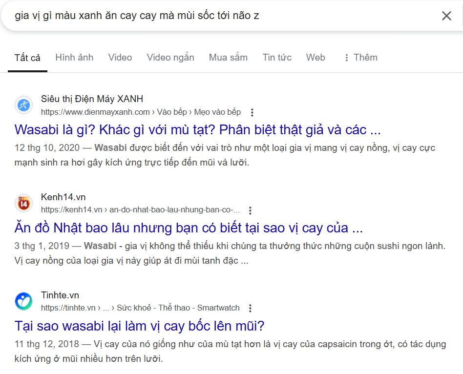

# Tom-s_Life
Tom in Vietnamese means shrimp. This github will mark her molting period. This is where Tom share anything about her life and hobbies: program, crochet, play guitar, draw, languages,...
Xinchao mấy bà nội Việt Nam, tôi tên Tôm. Đây sẽ là nơi tôi chia sẻ về cột sống và 1 vài điều thú dzj kkk

## Con Tôm lột xác
Có một câu tôi từng nghe ở đâu đó như thế này:"Hai mươi năm sau bạn sẽ hối hận vì những gì bạn không làm, hơn là những gì bạn đã làm. Vậy nên hãy tháo dây, nhổ neo ra khỏi bến đỗ an toàn". Từ đó nó đã trở thành hải đăng soi sáng tương lai tôi. Liều ăn nhiều đi các ông cháu. Biết đâu thành thầy Huấn 9 ngón giấu tên.
Muốn sống một cuộc sống bình thường nhưng không tầm thường thì tôi nghĩ mình nên làm gì đó. Một số người nghĩ tới việc làm những điều siu toa khủng lồ, giải cứu thế giới hay gì đó?=)) Với tôi - thứ không tầm thường - đơn giản là khi về già, tôi có thể chỉ vào ảnh, ngạo nghễ kể lại cho con cháu mình về những lần đầu tiên: 
	Lần đầu tiên cố gắng hết mình (học guitar đợt dịch nha mấy má, tập cỡ tuần chai hết ngón tay, quá xá đã)
	Lần đầu tiên bay ra biển lớn (oki cái này hiểu sao thì hiểu nè)
	Lần đầu tiên biết cách ăn cái cục màu xanh xanh mà nó cay cay, hít phát là thấy kiếp sau luôn. Bịt mũi dzo, vắt xíu quất cho dịu, chấm và cho vào mỏ hehe, đừng để lọt không khí nha, nó sốc tới óc lun á (hmm quên tên rồi 2 oi? sasimi? matcha? arigato?) (chị Tari bị anh Phăng-xoa cho ăn quả wasabi ai xừ cờ rim trôn Thái lan=)))
	...
 
Okj 4nk đ@~ tjm' đc k@i' ja vj kj4 :v nó là wasabi nha các ông bà cô chú
Và vào vấn đề chính, không ăn mày quá khứ nữa, tôi quyết định đóng góp thêm vào chuỗi lần đầu tiên viết web? NO! Nhà văn? NO! Tôi cũng không biết nên gọi nó là gì nhưng tôi đã muốn làm khá lâu rồi. Đại loại kiểu làm vlog hay gì đấy chia sẻ về cuộc sống đời thường. Làm vlog thì chưa đủ can đảm và quan trọng là cũng lười edit nên thôi mình gặp nhau qua con chữ nhé kkk. Để nói về con chữ thì kkk là điệu cười thương hiệu của con bạn tôi. Ban đầu chúng tôi chỉ sử dụng qua tin nhắn thôi, sau cùng bị nhiễm ra ngoài đời luôn ka ka ka \^0^/.
CHÀO MỪNG CÁC BẠN ĐẾN VỚI TỔ ẤM CỦA TOM - NƠI NGHĨ GÌ VIẾT NẤY.

## Tổng quan định hướng 
Hé lu các pé iu của ank <3 
Nếu các pé muốn trên thông thiên văn, dưới tường địa lí, oki các pé tìm đúng chỗ rồi. Ở đây anh sẽ chia sẻ về thần số học, cung hoàng đạo, lá số tử vi, thậm chí là bấm huyệt cũng có, ...
Nếu các pé muốn công dung ngôn hạnh, cầm kì thi họa thì cũng trúng mánh luôn. Ank đây sẽ đập đàn uku, guitar, organ, ... pé nào hư thì ank đập nốt. Anh còn có móc len, đan vòng, vài bức vẽ linh tinh hoặc 300 bài code thiếu nhi nếu cháu nào yêu cầu @@.
Nếu các pé muốn tán tỉnh, oki anh sẽ truyền lại vài quyển bí kíp gia truyền ( từ ank - người đã được kinh qua 0 mối tình, 3 lần crush, vô số lần né bả): flirt thần chưởng, ăn nem né thính,...
Bạn muốn hóng drama? Bạn yêu lịch sử? Việc gì khó đã có Tom lo! 4nk sẽ trải lòng về câu chuyện các cụ giàu có, đất rộng thẳng cánh cò bay, đến đời cháu chắt thì ngồi gõ phím bốc phét... Ờm... Đó là tôi thôi.

## Thời gian ra bài
Bây giờ đang rảnh nên có thể mỗi ngày một bài? Nào bận thì ráng tuần một bài hoặc một năm một bài?:) Còn thở là còn đăng bài nha anh em.

## Mọi thông tin chi tiết xin liên hệ tại phở bò (à tôi tới từ Nam Định và 3 đời bán phở bò xincamon):
[link](https://www.facebook.com/profile.php?id=61573646465671&locale=vi_VN)

